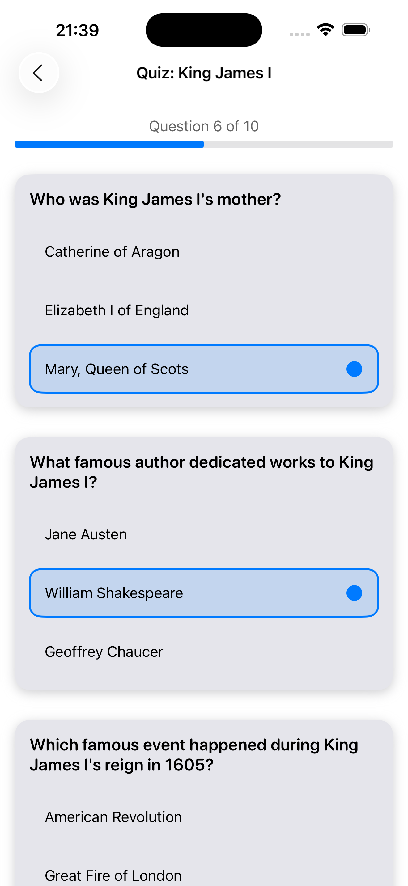
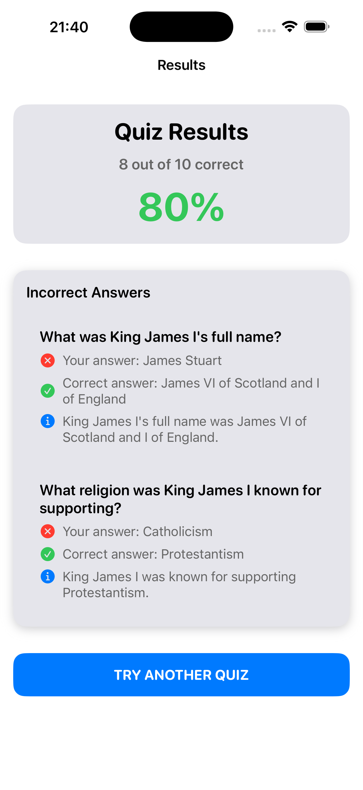

# InfiniQuiz

An elegant iOS quiz application that generates custom multiple-choice quizzes using OpenAI's ChatGPT API. Create quizzes on any subject and test your knowledge with intelligently generated questions.


## Features

### 🎯 Core Functionality
- **AI-Powered Quiz Generation**: Create custom quizzes on any topic using OpenAI's ChatGPT API
- **Multiple Quiz Lengths**: Choose between 10 or 20 questions per quiz
- **Smart Question Generation**: Ensures diverse, non-overlapping questions with clear correct answers
- **Quiz History**: Save and replay previous quizzes
- **Detailed Results**: View scores and review incorrect answers with explanations

### 🎨 User Experience
- **Adaptive Design**: Seamless light and dark mode support with optimized contrast
- **Haptic Feedback**: Tactile responses for all user interactions
- **Smooth Animations**: Polished transitions and button appearances
- **Auto-scroll**: Intelligent scrolling to show relevant content
- **Responsive UI**: Optimized for all iPhone screen sizes

### 🔐 Security & Privacy
- **Secure API Token Storage**: API keys stored in iOS Keychain with device-only access
- **Local Data Storage**: Quiz history stored locally using UserDefaults
- **No Data Collection**: Your quizzes and API keys never leave your device

## Screenshots

### 📱 iPhone 16 Pro Max (1320 x 2868 pixels)

<div align="center">

| Light Mode | Dark Mode |
|------------|-----------|
|  |  |
| **Home Screen** - Quiz creation interface | **Home Screen** - Clean, adaptive design |

</div>

<div align="center">

| Quiz Taking | Results with Explanations |
|-------------|---------------------------|
|  |  |
| **Active Quiz** - Multiple choice questions | **Results Screen** - Score and detailed explanations |

</div>

### ✨ Key Features Shown
- **🎨 Adaptive Design**: Seamless light and dark mode support
- **📊 Progress Tracking**: Visual progress bar during quizzes  
- **🎯 Answer Selection**: Clear selection indicators with blue accent
- **📈 Detailed Results**: Score percentage with explanations for wrong answers
- **ℹ️ Educational Value**: Authoritative explanations help users learn
- **📱 Responsive UI**: Optimized for all iPhone screen sizes

## Requirements

- iOS 17.0+
- Xcode 15.0+
- Swift 5.9+
- OpenAI API Key

## Installation

### Prerequisites
1. **OpenAI API Key**: Get your API key from [OpenAI Platform](https://platform.openai.com)
2. **Xcode**: Download from the Mac App Store

### Setup
1. **Clone the repository**:
   ```bash
   git clone https://github.com/yourusername/InfiniQuiz.git
   cd InfiniQuiz
   ```

2. **Open in Xcode**:
   ```bash
   open InfiniQuiz.xcodeproj
   ```

3. **Build and Run**:
   - Select your target device or simulator
   - Press `Cmd + R` to build and run

4. **Configure API Key**:
   - Launch the app
   - Tap the settings gear icon
   - Enter your OpenAI API key
   - Start creating quizzes!

## Usage

### Creating a Quiz
1. **Enter a Subject**: Type any topic you want to learn about
2. **Choose Question Count**: Select 10 or 20 questions
3. **Generate**: Tap "Generate Quiz" and wait for AI to create your questions
4. **Take the Quiz**: Answer each multiple-choice question
5. **View Results**: See your score and review any incorrect answers

### Managing Quizzes
- **Replay Quizzes**: Tap any quiz in the "Previous Quizzes" section
- **Delete Quizzes**: Swipe left or long-press for context menu
- **Review History**: All completed quizzes are automatically saved

### Settings
- **API Token Management**: Securely store and manage your OpenAI API key
- **Clear Token**: Remove stored API key when needed

## Architecture

### Design Pattern
The app follows the **MVVM (Model-View-ViewModel)** architecture pattern:

```
┌─────────────────┐    ┌─────────────────┐    ┌─────────────────┐
│     Views       │    │   ViewModels    │    │     Models      │
│                 │    │                 │    │                 │
│ • ContentView   │◄───┤ QuizViewModel   │◄───┤ Quiz            │
│ • QuizView      │    │ (@MainActor)    │    │ Question        │
│ • ResultsView   │    │                 │    │ QuizError       │
│ • SettingsView  │    │                 │    │                 │
└─────────────────┘    └─────────────────┘    └─────────────────┘
         │                       │                       │
         └───────────────────────┼───────────────────────┘
                                 │
                    ┌─────────────────┐
                    │    Services     │
                    │                 │
                    │ • ChatGPTService│
                    │ • KeychainHelper│
                    └─────────────────┘
```

### Key Components

#### Models (`/Models`)
- **`Quiz`**: Core quiz data structure with scoring logic
- **`Question`**: Individual question with choices and correct answer
- **`QuizError`**: Error types for API and network issues

#### ViewModels (`/ViewModels`)
- **`QuizViewModel`**: Main business logic and state management
  - `@MainActor` for UI thread safety
  - ObservableObject for SwiftUI binding
  - Handles quiz generation, selection, and persistence

#### Views (`/Views`)
- **`ContentView`**: Main navigation and home screen
- **`QuizView`**: Quiz-taking interface with questions
- **`ResultsView`**: Score display and incorrect answer review
- **`SettingsView`**: API token management

#### Services (`/Services`)
- **`ChatGPTService`**: OpenAI API integration
  - Async/await for modern concurrency
  - Error handling for API failures
  - JSON parsing with fallback logic
- **`KeychainHelper`**: Secure API token storage
  - iOS Keychain integration
  - Device-only access security

#### Components (`/Components`)
- **`DesignSystem`**: Reusable UI components and adaptive colors
  - Custom color system for light/dark mode
  - Consistent typography and spacing
  - Haptic feedback integration

## API Integration

### OpenAI Integration
The app uses OpenAI's `gpt-3.5-turbo` model for quiz generation:

```swift
// Example API request structure
{
  "model": "gpt-3.5-turbo",
  "messages": [
    {
      "role": "user", 
      "content": "Generate quiz about [subject] with [count] questions..."
    }
  ],
  "max_tokens": 2000,
  "temperature": 0.7
}
```

### Response Handling
- **Robust JSON Parsing**: Handles various response formats
- **Error Recovery**: Graceful fallbacks for malformed responses
- **Rate Limiting**: Proper handling of API rate limits

## Data Storage

### Local Persistence
- **Quiz History**: Stored in UserDefaults as JSON
- **User Preferences**: Question count and last subject
- **API Tokens**: Securely stored in iOS Keychain

### Data Models
All models conform to `Codable` for easy serialization:
```swift
struct Quiz: Identifiable, Codable {
    let id: UUID
    let subject: String
    var questions: [Question]
    // Computed properties for scoring
}
```

## Testing

### Test Coverage
The app includes comprehensive unit tests:

- **`QuizModelTests`**: Model logic and scoring
- **`QuizViewModelTests`**: Business logic and state management
- **`KeychainHelperTests`**: Secure storage functionality

### Running Tests
```bash
# Run all tests
cmd + u

# Run specific test file
cmd + ctrl + u (with file selected)
```

### Test Structure
```
InfiniQuizTests/
├── QuizModelTests.swift           # Model logic tests
├── QuizViewModelTests.swift       # ViewModel business logic
└── KeychainHelperTests.swift      # Security and storage tests
```

## Build Commands

### Development
```bash
# Build the project
xcodebuild -project InfiniQuiz.xcodeproj -scheme InfiniQuiz build

# Run on simulator
xcodebuild -project InfiniQuiz.xcodeproj -scheme InfiniQuiz \
  -destination 'platform=iOS Simulator,name=iPhone 15' build

# Clean build folder  
xcodebuild -project InfiniQuiz.xcodeproj clean
```

### Testing
```bash
# Run all tests
xcodebuild test -project InfiniQuiz.xcodeproj -scheme InfiniQuiz \
  -destination 'platform=iOS Simulator,name=iPhone 15'
```

## Security Considerations

### API Key Protection
- **Keychain Storage**: API keys stored in iOS Keychain with `kSecAttrAccessibleWhenUnlockedThisDeviceOnly`
- **No Hardcoding**: No API keys in source code or configuration files
- **Local Only**: API keys never transmitted except to OpenAI

### Data Privacy
- **Local Storage**: All quiz data remains on device
- **No Analytics**: No user tracking or data collection
- **Secure Communication**: HTTPS for all API communications

## Performance Optimizations

### Memory Management
- **@MainActor**: Ensures UI updates on main thread
- **Lazy Loading**: Questions loaded as needed
- **Efficient State**: Minimal observable state for smooth UI

### Network Efficiency
- **Request Optimization**: Optimized prompts for faster responses
- **Error Recovery**: Smart retry logic for failed requests
- **Timeout Handling**: Proper request timeouts

## Contributing

### Development Setup
1. Fork the repository
2. Create a feature branch: `git checkout -b feature/amazing-feature`
3. Make your changes and add tests
4. Ensure all tests pass: `cmd + u`
5. Commit your changes: `git commit -m 'Add amazing feature'`
6. Push to the branch: `git push origin feature/amazing-feature`
7. Open a Pull Request

### Code Style
- Follow Swift API Design Guidelines
- Use SwiftLint for code formatting (if configured)
- Write meaningful commit messages
- Include tests for new functionality

### Pull Request Process
1. Update documentation for any API changes
2. Add tests for new features
3. Ensure all existing tests pass
4. Update CLAUDE.md if architectural changes are made

## Troubleshooting

### Common Issues

#### API Token Issues
**Problem**: "Please configure your OpenAI API token" error
**Solution**: 
1. Go to Settings (gear icon)
2. Enter a valid OpenAI API key
3. Ensure the key has sufficient credits

#### Network Errors
**Problem**: Quiz generation fails with network error
**Solution**:
1. Check internet connection
2. Verify API key is valid
3. Check OpenAI service status

#### App Performance
**Problem**: App feels slow or unresponsive
**Solution**:
1. Restart the app
2. Clear quiz history if very large
3. Check available device storage

### Debug Information
Enable debug logging by modifying the ChatGPTService error handling for detailed API response information.

## Roadmap

### ✅ Completed Features
- [x] **Core Quiz Functionality**: AI-powered quiz generation with ChatGPT
- [x] **Adaptive UI Design**: Full light and dark mode support
- [x] **Secure API Management**: Keychain storage for OpenAI tokens
- [x] **Quiz History**: Save and replay previous quizzes
- [x] **Haptic Feedback**: Tactile responses throughout the app
- [x] **Answer Explanations**: Educational explanations for wrong answers
- [x] **Comprehensive Testing**: Unit tests for models, ViewModels, and services
- [x] **Professional Screenshots**: App Store ready marketing materials

### Planned Features
- [ ] **Custom Quiz Categories**: Predefined subject categories
- [ ] **Difficulty Levels**: Easy, Medium, Hard question modes
- [ ] **Timer Mode**: Timed quizzes with countdown
- [ ] **Statistics**: Detailed performance analytics
- [ ] **Export Results**: Share quiz results and statistics
- [ ] **Offline Mode**: Cached quizzes for offline use
- [ ] **Multiple Languages**: Localization support

### Technical Improvements
- [ ] **Widget Support**: iOS home screen widgets
- [ ] **Watch App**: Apple Watch companion app
- [ ] **iCloud Sync**: Cross-device quiz synchronization
- [ ] **Background Generation**: Pre-generate quizzes in background

## License

This project is licensed under the MIT License - see the [LICENSE](LICENSE) file for details.

## Acknowledgments

- **OpenAI**: For providing the ChatGPT API that powers quiz generation
- **Apple**: For SwiftUI and iOS development tools
- **Contributors**: Thanks to all contributors who help improve this app

## Support

### Getting Help
- **Issues**: Open an issue on GitHub for bugs or feature requests
- **Documentation**: Check this README and CLAUDE.md for detailed information
- **API Documentation**: Refer to [OpenAI API Documentation](https://platform.openai.com/docs)

### Contact
- **GitHub Issues**: [Create an issue](https://github.com/yourusername/InfiniQuiz/issues)
- **Email**: your.email@example.com

---

**Made with ❤️ using SwiftUI and OpenAI**